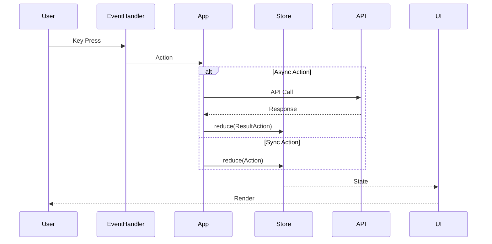

# Data Flow

Understanding how data flows through Clobster is key to working with the system effectively.

## Unidirectional Flow



## Example: Market Refresh

Let's trace through a market refresh operation:

### 1. User Input

User presses `r` to refresh:

```rust
// events/handler.rs
pub fn handle_key(&mut self, key: KeyEvent) -> Option<Action> {
    match key.code {
        KeyCode::Char('r') => Some(Action::RefreshMarkets),
        // ...
    }
}
```

### 2. Action Dispatch

The action is dispatched to the app:

```rust
// app.rs
pub async fn handle_action(&mut self, action: Action) -> Result<()> {
    match action {
        Action::RefreshMarkets => {
            self.store.reduce(Action::SetLoading(true));
            
            // Async API call
            match self.api.fetch_markets().await {
                Ok(markets) => {
                    self.store.reduce(Action::MarketsLoaded(markets));
                }
                Err(e) => {
                    self.store.reduce(Action::SetError(e.to_string()));
                }
            }
            
            self.store.reduce(Action::SetLoading(false));
        }
        // ...
    }
    Ok(())
}
```

### 3. State Update

The store updates synchronously:

```rust
// state/mod.rs
impl Store {
    pub fn reduce(&mut self, action: Action) {
        match action {
            Action::MarketsLoaded(markets) => {
                self.markets.items = markets;
                self.markets.loading = false;
            }
            Action::SetLoading(loading) => {
                self.app.loading = loading;
            }
            // ...
        }
    }
}
```

### 4. UI Render

The UI reads from state and renders:

```rust
// ui/mod.rs
pub fn render(&self, frame: &mut Frame, store: &Store) {
    if store.app.loading {
        // Show loading indicator
    } else {
        // Render market list from store.markets.items
    }
}
```

## Async Action Patterns

### Fire and Forget

For actions where we don't need to wait:

```rust
store.dispatch(Action::RefreshMarkets)?;
// Continues immediately
```

### With Loading State

For actions where we want to show progress:

```rust
store.reduce(Action::SetLoading(true));
let result = api.fetch_data().await;
store.reduce(Action::SetLoading(false));
store.reduce(Action::DataLoaded(result?));
```

### With Error Handling

```rust
match api.place_order(order).await {
    Ok(placed) => {
        store.reduce(Action::OrderPlaced(placed));
        store.reduce(Action::ShowNotification(
            Notification::success("Order placed!")
        ));
    }
    Err(e) => {
        store.reduce(Action::SetError(e.to_string()));
    }
}
```

## Channel-Based Communication

The store uses `tokio::sync::mpsc` for async dispatch:

```rust
pub struct Store {
    // ...
    action_tx: mpsc::UnboundedSender<Action>,
}

impl Store {
    pub fn dispatch(&self, action: Action) -> Result<()> {
        self.action_tx.send(action)
            .map_err(|_| Error::channel("Action dispatch failed"))
    }
}
```

The app receives actions in its event loop:

```rust
loop {
    tokio::select! {
        Some(action) = action_rx.recv() => {
            self.handle_action(action).await?;
        }
        // ... other events
    }
}
```
