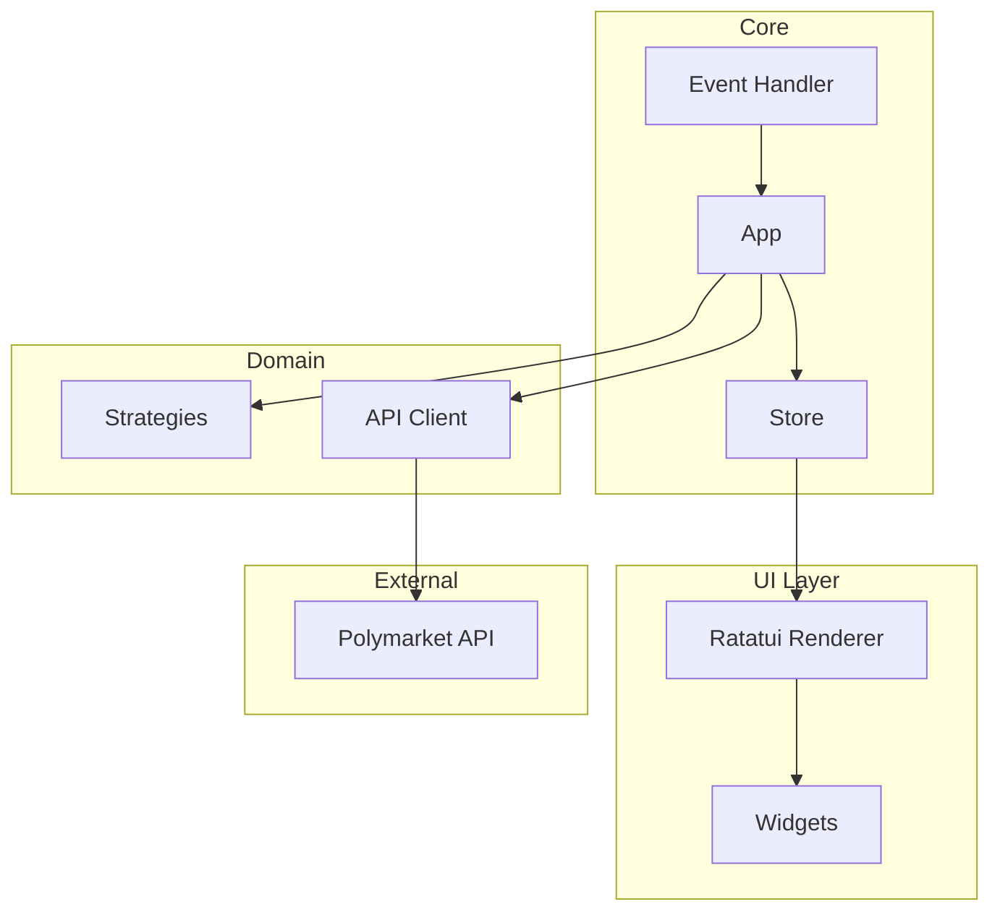

# Architecture Overview

CLOBster is built on a clean, modular architecture designed for reliability and extensibility.

## High-Level Architecture



## Module Overview

| Module | Responsibility |
|--------|----------------|
| `app` | Application lifecycle, event loop, async task coordination |
| `state` | Centralized state with `Store`, `Action` enum, domain states |
| `ui` | Ratatui rendering, layout management, widgets |
| `events` | Input handling, key binding to action mapping |
| `api` | Polymarket API wrapper via `polymarket-rs` |
| `strategy` | Trading strategy framework with signals and risk management |
| `config` | Configuration loading and validation |
| `error` | Unified error types and handling |

## Design Principles

### 1. Unidirectional Data Flow

All state mutations flow through a single path:

```
User Input → Action → Store::reduce() → UI Render
```

This makes state changes predictable and debuggable.

### 2. Separation of Concerns

- **UI** only reads from state and renders
- **Events** only map inputs to actions
- **Store** only handles state mutations
- **API** only handles external communication

### 3. Async-First Design

Long-running operations (API calls, WebSocket connections) run asynchronously without blocking the UI.

### 4. Type Safety

- All financial values use `rust_decimal::Decimal` (never `f64`)
- Strong typing for order types, sides, and states
- Compile-time guarantees via Rust's type system

## Directory Structure

```
src/
├── app.rs              # Main application loop
├── error.rs            # Error types
├── lib.rs              # Library exports
├── main.rs             # Entry point
├── api/                # Polymarket API integration
│   ├── client.rs       # HTTP/WebSocket client
│   ├── converter.rs    # Type conversions
│   └── mod.rs
├── config/             # Configuration management
│   ├── settings.rs     # Config schema
│   └── mod.rs
├── events/             # Input handling
│   ├── handler.rs      # Key → Action mapping
│   ├── input.rs        # Raw input processing
│   └── mod.rs
├── state/              # State management
│   ├── app_state.rs    # Application state
│   ├── market_state.rs # Market data
│   ├── order_state.rs  # Order tracking
│   ├── orderbook_state.rs # Order book depth data
│   ├── portfolio_state.rs # Portfolio/positions
│   └── mod.rs          # Store and Action enum
├── strategy/           # Trading strategies
│   ├── context.rs      # Strategy context
│   ├── engine.rs       # Strategy execution
│   ├── risk.rs         # Risk management
│   ├── signal.rs       # Trading signals
│   ├── traits.rs       # Strategy trait
│   └── strategies/     # Built-in strategies
└── ui/                 # User interface
    ├── layout.rs       # Screen layout
    ├── mod.rs          # UI coordination
    └── widgets/        # Reusable components
```

## Next Steps

- [State Management](./state-management.md) - Deep dive into the Store pattern
- [Data Flow](./data-flow.md) - Understanding action dispatch and async operations
