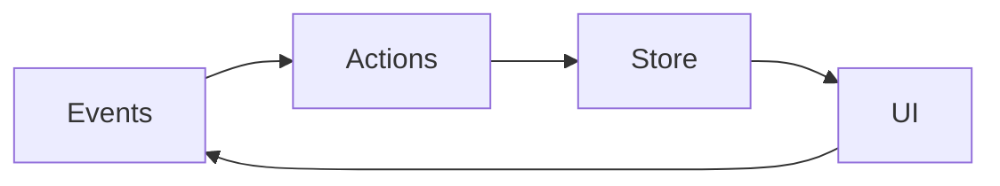

# CLOBster

**CLOBster** is a production-grade terminal user interface (TUI) framework for [Polymarket](https://polymarket.com) prediction markets. Built with [Rust](https://rust-lang.org), [ratatui](https://ratatui.rs), and [polymarket-rs](https://crates.io/crates/polymarket-rs).

## Features

- 🖥️ **Modern TUI** - Beautiful terminal interface with vim-style navigation
- 📊 **Real-time Data** - Live market updates via WebSocket
- 🤖 **Programmable Strategies** - Build and deploy custom trading strategies
- ⚡ **High Performance** - Built in Rust for speed and reliability
- 🛡️ **Risk Management** - Built-in guards and position limits

## Quick Example

```rust
use clobster::strategy::{Strategy, StrategyContext, Signal};
use rust_decimal::Decimal;
use rust_decimal_macros::dec;

struct MyStrategy {
    threshold: Decimal,
}

impl Strategy for MyStrategy {
    fn name(&self) -> &str { "my_strategy" }

    fn evaluate(&mut self, ctx: &StrategyContext) -> Vec<Signal> {
        let mut signals = vec![];
        for market in ctx.markets() {
            if let Some(outcome) = market.outcomes.first() {
                if outcome.price < self.threshold {
                    signals.push(Signal::buy(
                        market.id.clone(),
                        outcome.token_id.clone(),
                        dec!(0.10),
                    ));
                }
            }
        }
        signals
    }
}
```

## Architecture at a Glance

CLOBster follows a **unidirectional data flow** pattern:



## Project Status

CLOBster is under active development. See the [GitHub repository](https://github.com/thiras/clobster) for the latest updates.

## License

CLOBster is licensed under the MIT License.
