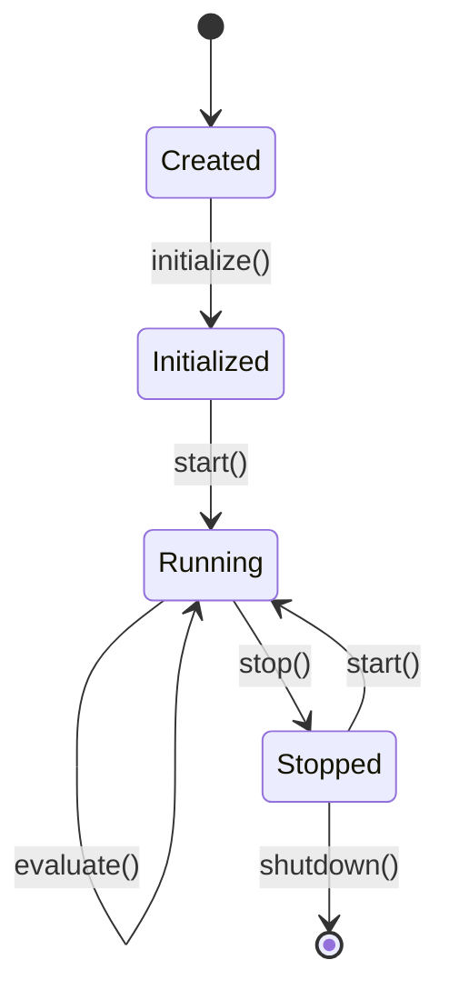

# Built-in Strategies

Clobster includes several ready-to-use strategies. Each implements different market dynamics and can be customized via parameters.

## Available Strategies

| Strategy | Description | Best For |
|----------|-------------|----------|
| [Momentum](./momentum.md) | Follows price trends | Trending markets |
| [Mean Reversion](./mean-reversion.md) | Bets on price returning to average | Range-bound markets |
| [Spread](./spread.md) | Profits from bid-ask spread | High-volume markets |

## Common Configuration

All built-in strategies share a common configuration structure:

```rust
use clobster::strategy::{StrategyConfig, MomentumStrategy};

let config = StrategyConfig::default()
    .with_enabled(true)
    .with_parameter("lookback_periods", 10)
    .with_parameter("threshold", 0.05);

let mut strategy = MomentumStrategy::new();
strategy.initialize(&config).await?;
```

## Loading Strategies

```rust
use clobster::strategy::{StrategyEngine, MomentumStrategy, MeanReversionStrategy};

let mut engine = StrategyEngine::new(risk_config);

engine.register(Box::new(MomentumStrategy::default()));
engine.register(Box::new(MeanReversionStrategy::default()));

// Run evaluation
let signals = engine.evaluate(&context);
```

## Strategy Lifecycle



## Comparing Strategies

| Aspect | Momentum | Mean Reversion | Spread |
|--------|----------|----------------|--------|
| Market Condition | Trending | Range-bound | Any |
| Holding Period | Medium | Short | Very Short |
| Win Rate | Lower | Higher | Higher |
| Profit per Trade | Higher | Lower | Lower |
| Risk Level | Higher | Medium | Lower |
