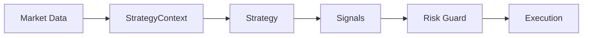

# Trading Strategies

CLOBster provides a powerful framework for building and deploying automated trading strategies on Polymarket.

## Why Strategies?

Prediction markets move fast. Manual trading is:
- Time-consuming
- Emotionally driven
- Prone to missed opportunities

Automated strategies can:
- React instantly to market changes
- Execute consistently without emotion
- Monitor multiple markets simultaneously
- Apply rigorous risk management

## Strategy Framework Overview



## Core Components

### Strategy Trait

The foundation of all strategies:

```rust
#[async_trait]
pub trait Strategy: Send + Sync + Debug {
    fn name(&self) -> &str;
    fn evaluate(&mut self, ctx: &StrategyContext) -> Vec<Signal>;
}
```

### StrategyContext

Market snapshot provided to strategies:

```rust
pub struct StrategyContext {
    markets: Vec<MarketSnapshot>,
    positions: Vec<PositionSnapshot>,
    orders: Vec<OrderSnapshot>,
    available_balance: Decimal,
    timestamp: DateTime<Utc>,
}
```

### Signals

Trading intentions generated by strategies:

```rust
let signal = Signal::buy("market_id", "token_id", dec!(0.10))
    .with_limit_price(dec!(0.45))
    .with_strength(SignalStrength::Strong)
    .with_reason("Price below fair value");
```

### Risk Guard

Validates signals before execution:

```rust
pub struct RiskConfig {
    pub max_position_size: Decimal,
    pub max_order_size: Decimal,
    pub max_daily_loss: Decimal,
    pub max_open_orders: usize,
}
```

## Getting Started

1. **Use built-in strategies** - Start with `MomentumStrategy`, `MeanReversionStrategy`, or `SpreadStrategy`
2. **Configure risk limits** - Set appropriate position and loss limits
3. **Paper trade first** - Test strategies without real money
4. **Monitor and iterate** - Adjust parameters based on performance

## Next Steps

- [Built-in Strategies](./built-in.md) - Strategies included with CLOBster
- [Custom Strategies](./custom.md) - Build your own strategies
- [Risk Management](./risk-management.md) - Configure safeguards
