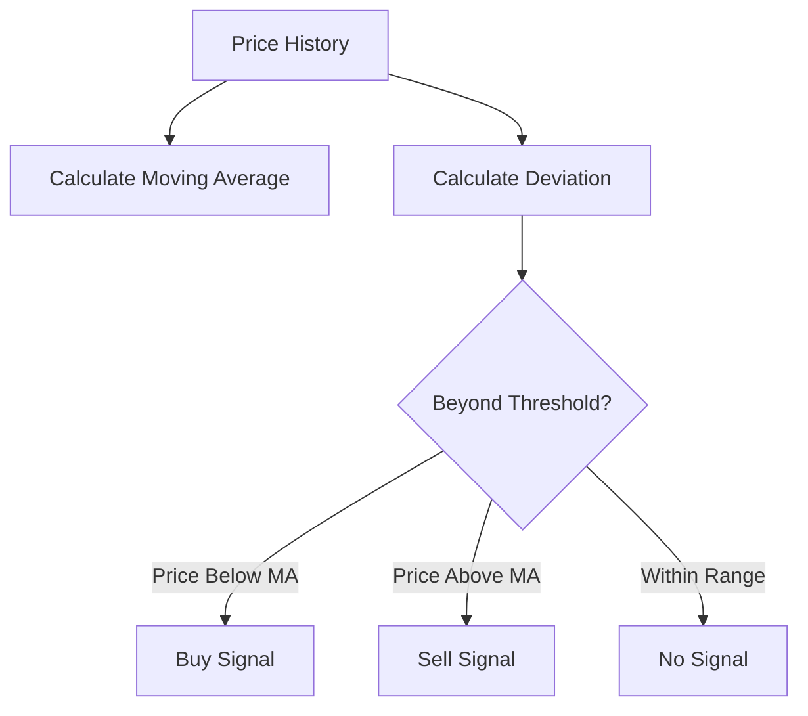

# Mean Reversion Strategy

The mean reversion strategy bets that prices will return to their historical average after deviating significantly.

## How It Works



## Theory

Mean reversion assumes that extreme price movements are temporary and prices will eventually return to a "fair value" or average level. In prediction markets, this often happens when:

- Markets overreact to news
- Noise traders push prices away from fundamentals
- Temporary liquidity imbalances occur

The z-score measures how far the price is from its mean:

$$z = \frac{P - \mu}{\sigma}$$

Where:
- $P$ = Current price
- $\mu$ = Moving average (mean)
- $\sigma$ = Standard deviation

## Configuration

```rust
use clobster::strategy::MeanReversionStrategy;

let strategy = MeanReversionStrategy::builder()
    .window_size(20)           // Periods for moving average
    .entry_z_score(2.0)        // Enter when z > 2 or z < -2
    .exit_z_score(0.5)         // Exit when z returns to ±0.5
    .position_size(0.10)       // 10% of available balance
    .build();
```

## Parameters

| Parameter | Type | Default | Description |
|-----------|------|---------|-------------|
| `window_size` | `usize` | 20 | Periods for moving average |
| `entry_z_score` | `Decimal` | 2.0 | Z-score threshold for entry |
| `exit_z_score` | `Decimal` | 0.5 | Z-score threshold for exit |
| `position_size` | `Decimal` | 0.10 | Position size as fraction |
| `min_samples` | `usize` | 10 | Minimum samples before trading |

## Example Signals

```rust
// Price significantly below average
Signal::buy("market_456", "token_yes", dec!(0.10))
    .with_limit_price(dec!(0.35))
    .with_strength(SignalStrength::Strong)
    .with_reason("Z-score: -2.3, price likely to revert")

// Price returned to mean
Signal::sell("market_456", "token_yes", dec!(0.10))
    .with_strength(SignalStrength::Medium)
    .with_reason("Z-score: 0.4, mean reversion complete")
```

## When to Use

✅ **Good for:**
- Stable markets with established price ranges
- Markets where fundamentals haven't changed
- After sudden price spikes from large orders

❌ **Avoid when:**
- Genuine new information is moving the market
- Market is trending (momentum dominates)
- Near resolution (prices converge to 0 or 1)

## Statistical Foundation

The strategy assumes price changes are approximately normally distributed around a mean. The entry z-score of 2.0 means:

- ~95% of prices fall within this range
- Entry triggers on statistically unusual deviations
- Higher z-scores = more selective but fewer trades

## Performance Considerations

- **Win rate**: Typically 55-65% (small frequent wins)
- **Profit per trade**: Usually smaller than momentum
- **Drawdowns**: Can be severe if regime changes
- **Best for**: Range-bound, liquid markets
