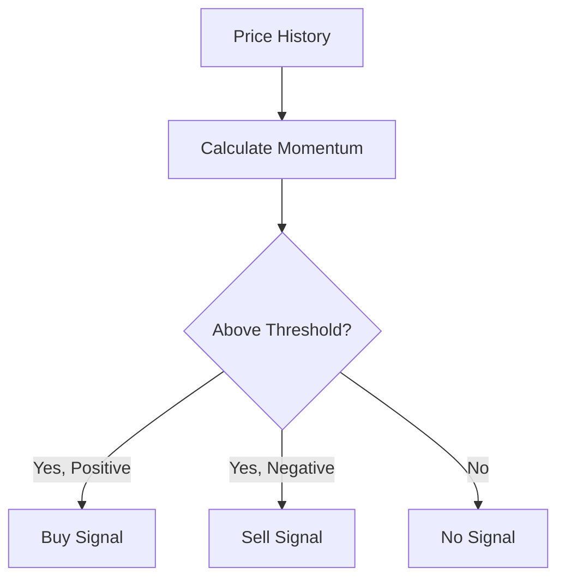

# Momentum Strategy

The momentum strategy follows price trends, buying when prices are rising and selling when they're falling.

## How It Works



## Theory

Momentum trading is based on the observation that assets that have been rising tend to continue rising (and vice versa). In prediction markets, this often reflects:

- New information being gradually incorporated
- Herding behavior among traders
- Self-reinforcing price dynamics

The momentum $M$ is calculated as:

$$M = \frac{P_t - P_{t-n}}{P_{t-n}}$$

Where:
- $P_t$ = Current price
- $P_{t-n}$ = Price $n$ periods ago

## Configuration

```rust
use clobster::strategy::MomentumStrategy;

let strategy = MomentumStrategy::builder()
    .lookback_periods(10)      // Number of periods for momentum calculation
    .entry_threshold(0.05)     // 5% momentum to trigger entry
    .exit_threshold(0.02)      // 2% reversal to trigger exit
    .position_size(0.10)       // 10% of available balance
    .build();
```

## Parameters

| Parameter | Type | Default | Description |
|-----------|------|---------|-------------|
| `lookback_periods` | `usize` | 10 | Periods for momentum calculation |
| `entry_threshold` | `Decimal` | 0.05 | Minimum momentum for entry |
| `exit_threshold` | `Decimal` | 0.02 | Momentum reversal for exit |
| `position_size` | `Decimal` | 0.10 | Position size as fraction of balance |
| `max_positions` | `usize` | 5 | Maximum concurrent positions |

## Example Signals

```rust
// Strong upward momentum detected
Signal::buy("market_123", "token_yes", dec!(0.10))
    .with_strength(SignalStrength::Strong)
    .with_reason("Momentum: +8.5% over 10 periods")

// Momentum reversal detected
Signal::sell("market_123", "token_yes", dec!(0.10))
    .with_strength(SignalStrength::Medium)
    .with_reason("Momentum reversed: -3.2%")
```

## When to Use

✅ **Good for:**
- Markets with clear directional moves
- High-profile events with gradual information release
- Markets with consistent trading volume

❌ **Avoid when:**
- Markets are choppy or range-bound
- Low liquidity (slippage will eat profits)
- Near market resolution (volatility spikes)

## Performance Considerations

- **Win rate**: Typically 40-50% (relies on larger wins)
- **Drawdowns**: Can be significant in choppy markets
- **Best timeframe**: Medium-term (hours to days)
