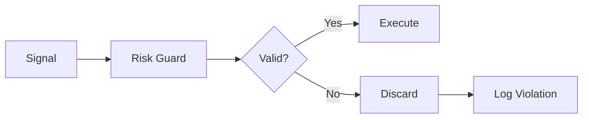

# Risk Management

CLOBster includes a comprehensive risk management system to protect your capital.

## Risk Guard

The `RiskGuard` validates all signals before execution:



## Configuration

```rust
use clobster::strategy::{RiskConfig, RiskGuard};
use rust_decimal_macros::dec;

let risk_config = RiskConfig {
    // Position limits
    max_position_size: dec!(1000.0),      // Max size per position
    max_total_exposure: dec!(5000.0),     // Max total across all positions
    max_position_per_market: dec!(500.0), // Max per market
    
    // Order limits
    max_order_size: dec!(100.0),          // Max single order
    max_open_orders: 10,                  // Max concurrent orders
    
    // Loss limits
    max_daily_loss: dec!(200.0),          // Stop trading after this loss
    max_drawdown_pct: dec!(0.10),         // 10% max drawdown
    
    // Execution limits
    min_order_size: dec!(1.0),            // Minimum order size
    max_slippage_pct: dec!(0.02),         // 2% max slippage
};

let risk_guard = RiskGuard::new(risk_config);
```

## Risk Checks

### Position Size Limits

Prevents over-concentration in any single position:

```rust
// Signal rejected if it would exceed max position
if current_position + signal.size > config.max_position_size {
    return Err(RiskViolation::PositionSizeExceeded);
}
```

### Total Exposure Limits

Caps your overall market exposure:

```rust
// Sum of all position values
let total_exposure: Decimal = positions.iter()
    .map(|p| p.size * p.current_price)
    .sum();

if total_exposure > config.max_total_exposure {
    return Err(RiskViolation::TotalExposureExceeded);
}
```

### Daily Loss Limits

Stops trading after significant losses:

```rust
if daily_pnl < -config.max_daily_loss {
    return Err(RiskViolation::DailyLossExceeded);
}
```

### Drawdown Protection

Monitors peak-to-trough decline:

$$\text{Drawdown} = \frac{\text{Peak} - \text{Current}}{\text{Peak}}$$

```rust
let drawdown = (peak_balance - current_balance) / peak_balance;
if drawdown > config.max_drawdown_pct {
    return Err(RiskViolation::MaxDrawdownExceeded);
}
```

## Risk Violations

When a signal violates risk rules, a `RiskViolation` is returned:

```rust
pub enum RiskViolation {
    PositionSizeExceeded { current: Decimal, requested: Decimal, max: Decimal },
    TotalExposureExceeded { current: Decimal, max: Decimal },
    DailyLossExceeded { loss: Decimal, max: Decimal },
    MaxDrawdownExceeded { drawdown: Decimal, max: Decimal },
    OrderSizeExceeded { size: Decimal, max: Decimal },
    TooManyOpenOrders { count: usize, max: usize },
    InsufficientBalance { required: Decimal, available: Decimal },
    SlippageExceeded { expected: Decimal, actual: Decimal },
}
```

## Using Risk Guard

```rust
use clobster::strategy::{StrategyEngine, RiskGuard};

let mut engine = StrategyEngine::new(risk_config);
engine.register(Box::new(my_strategy));

// Signals are automatically validated
let signals = engine.evaluate(&context);

// Or validate manually
for signal in signals {
    match risk_guard.validate(&signal, &context) {
        Ok(()) => execute_signal(signal),
        Err(violation) => log::warn!("Signal rejected: {:?}", violation),
    }
}
```

## Recommended Settings

### Conservative

For beginners or testing:

```rust
RiskConfig {
    max_position_size: dec!(100.0),
    max_total_exposure: dec!(500.0),
    max_order_size: dec!(25.0),
    max_daily_loss: dec!(50.0),
    max_drawdown_pct: dec!(0.05),  // 5%
    ..Default::default()
}
```

### Moderate

For experienced traders:

```rust
RiskConfig {
    max_position_size: dec!(500.0),
    max_total_exposure: dec!(2500.0),
    max_order_size: dec!(100.0),
    max_daily_loss: dec!(200.0),
    max_drawdown_pct: dec!(0.10),  // 10%
    ..Default::default()
}
```

### Aggressive

For professionals only:

```rust
RiskConfig {
    max_position_size: dec!(2000.0),
    max_total_exposure: dec!(10000.0),
    max_order_size: dec!(500.0),
    max_daily_loss: dec!(500.0),
    max_drawdown_pct: dec!(0.20),  // 20%
    ..Default::default()
}
```

## Best Practices

1. **Start conservative** - You can always increase limits
2. **Set daily loss limits** - Prevents emotional revenge trading
3. **Monitor drawdown** - Large drawdowns are hard to recover from
4. **Diversify** - Use `max_position_per_market` to spread risk
5. **Review violations** - They may indicate strategy issues
6. **Paper trade first** - Test risk limits without real money
