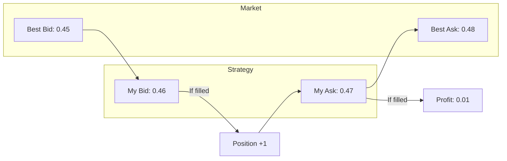

# Spread Strategy

The spread strategy profits from the bid-ask spread by providing liquidity to the market.

## How It Works



## Theory

Spread trading (market making) profits from the difference between buy and sell prices. The strategy:

1. Places buy orders slightly above the best bid
2. Places sell orders slightly below the best ask
3. Profits when both sides fill

Expected profit per round-trip:

$$\pi = S - 2c$$

Where:
- $S$ = Captured spread
- $c$ = Trading costs per side

## Configuration

```rust
use clobster::strategy::SpreadStrategy;

let strategy = SpreadStrategy::builder()
    .min_spread(dec!(0.02))    // Minimum spread to trade
    .edge(dec!(0.005))         // How much inside the spread to quote
    .order_size(dec!(10.0))    // Size per order
    .max_position(dec!(100.0)) // Maximum inventory
    .skew_factor(dec!(0.001))  // Price adjustment per unit inventory
    .build();
```

## Parameters

| Parameter | Type | Default | Description |
|-----------|------|---------|-------------|
| `min_spread` | `Decimal` | 0.02 | Minimum spread to participate |
| `edge` | `Decimal` | 0.005 | Distance inside best bid/ask |
| `order_size` | `Decimal` | 10.0 | Size of each order |
| `max_position` | `Decimal` | 100.0 | Maximum inventory |
| `skew_factor` | `Decimal` | 0.001 | Price skew per inventory unit |
| `refresh_interval` | `Duration` | 5s | Order refresh frequency |

## Inventory Management

The strategy adjusts quotes based on current inventory to avoid accumulating risk:

$$P_{bid} = P_{mid} - \frac{S}{2} - \alpha \cdot I$$
$$P_{ask} = P_{mid} + \frac{S}{2} - \alpha \cdot I$$

Where:
- $P_{mid}$ = Mid price
- $S$ = Target spread
- $\alpha$ = Skew factor
- $I$ = Current inventory (positive = long)

When long, asks are lowered to encourage selling (reducing inventory), and bids are also lowered to discourage further buying.

## Example Signals

```rust
// Place bid inside spread
Signal::buy("market_789", "token_yes", dec!(10.0))
    .with_limit_price(dec!(0.46))
    .with_strength(SignalStrength::Low)
    .with_reason("Spread capture: bid inside 0.45/0.48")

// Place ask to close position
Signal::sell("market_789", "token_yes", dec!(10.0))
    .with_limit_price(dec!(0.47))
    .with_strength(SignalStrength::Low)
    .with_reason("Spread capture: ask inside 0.45/0.48")
```

## When to Use

✅ **Good for:**
- High-volume markets with consistent spreads
- Markets without strong directional bias
- When you can monitor and adjust frequently

❌ **Avoid when:**
- Spreads are very tight (no profit margin)
- Market is highly volatile
- Low volume (orders won't fill)
- Strong directional moves (adverse selection)

## Risk Factors

1. **Adverse Selection**: Informed traders may pick you off
2. **Inventory Risk**: One side may fill faster than the other
3. **Market Jumps**: Sudden moves can cause losses
4. **Competition**: Other market makers may outcompete you

## Performance Considerations

- **Win rate**: Very high (70-80%) when spreads are captured
- **Profit per trade**: Small (the spread minus costs)
- **Volume needed**: High frequency for meaningful returns
- **Monitoring**: Requires active management
